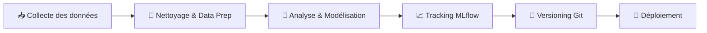
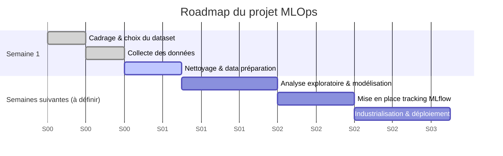

# 📋 Document de Cadrage — Projet MLOps

> Prédiction de la performance et de la réussite des étudiants aux examens

---

## 📑 Sommaire

1. [Contexte & objectifs](#-contexte--objectifs)
2. [Jeu de données](#-jeu-de-données)
3. [Stack technique & références](#-stack-technique--références)
4. [Équipe & répartition des tâches](#-équipe--répartition-des-tâches)
5. [Calendrier prévisionnel](#-calendrier-prévisionnel)
6. [Contact référent](#-contact-référent)

---

## 🎯 Contexte & objectifs

| | |
|---|---|
| **Problématique** | *À formaliser collectivement (voir tâche "définition de la problématique et des enjeux")* |
| **Enjeux** | *À compléter — impact métier, cas d'usage visé, valeur ajoutée du pipeline MLOps* |
| **Livrable final** | Pipeline ML de bout en bout : collecte → préparation → modélisation → tracking → déploiement |

> ✏️ **À faire (all)** : rédiger en 3–5 lignes la problématique métier et les enjeux du projet avant la fin de la Semaine 1.

---

## 📊 Jeu de données

| Élément | Détail |
|---|---|
| **Nom** | Student Exam Performance and Success Dataset |
| **Source** | Kaggle |
| **Lien** | [kaggle.com/.../student-exam-performance-and-success-dataset](https://www.kaggle.com/datasets/mobeenfatimah/student-exam-performance-and-success-dataset) |
| **Choisi par** | 👥 Toute l'équipe |

---

## 🛠️ Stack technique & références

| Ressource | Lien |
|---|---|
| 🧑‍🏫 Repo de référence (prof) | [github.com/data-corentinv/tp_mlflow](https://github.com/data-corentinv/tp_mlflow/tree/main/foodcast/application) |
| 📦 Tracking des expériences | MLflow |
| 🗂️ Versioning | Git / GitHub |

---

## 👥 Équipe & répartition des tâches

| Tâche | Responsable(s) | Statut |
|---|---|---|
| Choix du jeu de données | 👥 Toute l'équipe | ✅ Fait |
| Définition de la problématique & enjeux | 👥 Toute l'équipe | 🟡 À faire |
| Analyse & Modélisation | 👩 Sarah, 👩 Lilou | 🟡 À faire |
| Gestion du Git *(admin)* | 👩‍💻 Anne *(admin)*, 👥 all | 🟢 En place |
| Tracking MLflow | 👩 Lilou | 🟡 À faire |

---

## 📅 Calendrier prévisionnel

| Semaine | Objectifs |
|---|---|
| **Semaine 1** | Cadrage, choix du jeu de données, collecte, nettoyage et data préparation |
| **Semaine 2** *(à définir)* | Analyse exploratoire, premiers modèles |
| **Semaine 3** *(à définir)* | Tracking des expériences avec MLflow |
| **Semaine 4** *(à définir)* | Industrialisation / déploiement |

> ⚠️ Seule la Semaine 1 est confirmée dans le brief initial — les semaines suivantes sont proposées à titre indicatif et à valider en équipe.

---

## 📞 Contact référent

| | |
|---|---|
| 👤 **Nom** | Corentin Vasseur |
| 📧 **Mail** | [vasseur.corentin@gmail.com](mailto:vasseur.corentin@gmail.com) |
| 📱 **Téléphone** | 06 76 56 99 15 |

---

Document de cadrage — mis à jour au fil du projet

